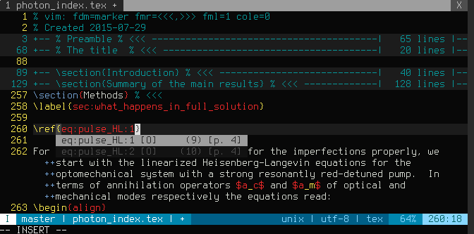

# omnster.vim

The default colorscheme for terminal vim with magenta and cyan replaced to lower contrast.

The colorscheme is built on top of the [template][] by Hans Fugal.

  [template]: http://www.vim.org/scripts/script.php?script_id=106
